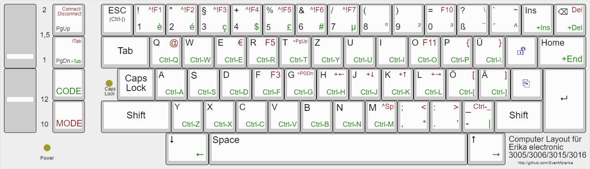

# German keyboard layout for Erika 3005,3006,3015,3016
*(and compatible)*

To use the typewriter keyboard as computer keyboard some keys are
mapped to different chars, since these are needed for computer use.

Especialy for terminal use, you will need control keys, most of them
are mapped to CODE+A - CODE-Z, see below for more details.

The 3005 typewriter has an aditional layer via MODE key avaiable. 
So I could add special keys like cursor and mouse.
The cursor keys are arranged to wasd standard.
See below for details.

## Overview layout

notes:
- mouse keys are not included in this picture
- Connect/Disconnect's the typewriter from computer as keyboard or standalone use as typewriter
- red description means the key is pressed together with MODE-key
- green description means the key is pressed together with  
- \+ means Shift, so +Tab means it sends Shift+Tab
- ! means Alt, so !Tab means it sends Alt+Tab
- ^ means CTRL
- the above can be combined, so ^!F1 means CTRL-ALT-F1, which switches to first console on Linux
- ^Sp means CTRL-Space which is "set-mark" in emacs
- arrow mean cursor key
- ⌫ means Backspace or DeleteLeft
<!-- -  -->
-  this is border unlock key, currently not used
-  this is form feed key, it allows to load paper even in connected mode

## Standard chars
- all char keys just generate that char pictured on the key
- acute key is used to generate composed chars (like é,è,ê)
- shift-ß is also used to generate composed chars (like ë)

### additional chars
key code | key                  | char generated
-----|--------------------------|------------
0xdf | MODE+,			| <
0xe3 | MODE+.			| >
0xe5 | MODE+P			| {
0xe6 | MODE+Ö			| [
0xe8 | MODE+ß			| \
0xe9 | MODE+Ü			| }
0xea | MODE+Ä			| ]
0xec | MODE+`			| ~
0xc1 | MODE+Q			| @
0xc9 | MODE+E			| €

### special functions

 key code | key | function
------|-----|----------
0x72  | backstep/backspacer	| insert
0x75  | half line forward	| cursor down
0x76  | half line backward	| cursor up
0x77  | Carriage return 	| Enter
0x79  | Tab			| Tab
0x7a  | T+			| Page up
0x7b  | T-			| Page down
0x7e  | Margin setting left 	| ESC
0x80  | Margin release 		|
0x83  | Form feed/paper insert	| forward form feed
0x84  | 1 line spacing		|
0x85  | 1,5 line spacing	|
0x86  | 2 lines spacing		|
0x87  | 10 cpi/ type spacing	|
0x88  | 12 cpi/ type spacing	|
0xae  | backspace/correction	| Backspace
0xaf  | REL			| Home

#### special chars with CODE

 key code | key | function
------|-----|----------
0x74  | CODE backstep/backspace   | shift insert
0xf7  | CODE backspace/correction | shift delete
0x7f  | Margin setting right	  | CTRL-ESC
0x7c  | CODE T-			  | shift-tab
0x7d  | CODE T+			  | mouse step width
0x81  | CODE micro line forward	  | cursor left
0x82  | CODE micro line backward  | cursor right
0xad  | CODE REL		  | shift End

#### special chars with MODE
 key code | key | function
----------|-----|----------
0xfb  | MODE backspace/correction | delete
0xf4	  | MODE T+    | switch computer/typewriter
0xf5	  | MODE T-    | ALT-tab (switch window)
0xc1	  | MODE 1     | CTRL-ALT-F1 (switch tty1)
0xc4	  | MODE 2     | CTRL-ALT-F2 (switch tty2)
0xc8	  | MODE 3     | CTRL-ALT-F3 (switch tty3)
0xcc	  | MODE 4     | CTRL-ALT-F4 (switch tty4)
0xd0	  | MODE 5     | CTRL-ALT-F5 (switch tty5)
0xd4	  | MODE 6     | CTRL-ALT-F6 (switch tty6)
0xd8	  | MODE 7     | CTRL-ALT-F7 (switch tty7)
0xdc	  | MODE 8     |
0xe0	  | MODE 9     |
0xe4	  | MODE 0     | F10 (Menu in Emacs)
0xe8	  | MODE O     | F11 (fullscreen)
0xcd	  | MODE R     | F5  (refresh)
0xce	  | MODE F     | F3  (find)
0xd3  | MODE M      | CTRL-Space (set-mark emacs)

### CTRL keys
**from CODE A until CODE Z - generate corresponding CTRL-A until CTRL-Z**

 key code | key    | function
----------|--------|----------
0xbb+0xe9 | CODE-Ü | CTRL-\ 0x1c
0xbb+0xe6 | CODE-Ö | CTRL-[ 0x1b
0xbb+0xea | CODE-Ä | CTRL-] 0x1d
          |        | CTRL-^ 0x1e (not implemented, use ESC)
0xe7	  | MODE-_ | CTRL-_ 0x1f

### Cursor keys
key code | key | function
---------|-----|----------
0x75  | half line forward	  | cursor down
0x76  | half line backward	  | cursor up
0x81  | CODE micro line forward	  | cursor left
0x82  | CODE micro line backward  | cursor right
0x7a  | T+			  | Page up
0x7b  | T-			  | Page down
0xe2  | MODE L 			  | shift cursor rigth
0xda  | MODE J 			  | shift cursor down
0xde  | MODE K 			  | shift cursor up
0xd6  | MODE H 			  | shift cursor left
0xd1  | MODE T 			  | shift page up
0xd2  | MODE G 			  | shift page down
0xeb  | REL 			  | HOME
0xee  | CODE REL		  | END

### Mouse keys
key code | key          | function
---------|--------------|----------
0x7d	 | CODE T+	| step width for mouse (1,4,8,16)
0xc3 	 | MODE Y	| mouse btn left
0xcb 	 | MODE C  	| mouse btn right 
0xc7 	 | MODE X	| mouse btn left on (tap step down for off)
0xcf 	 | MODE V	| mouse btn right on (tap step up for off)
0xc2 	 | CODE A 	| mouse left
0xc6 	 | CODE S 	| mouse down
0xc5 	 | CODE W 	| mouse up
0xca 	 | CODE D 	| mouse right

