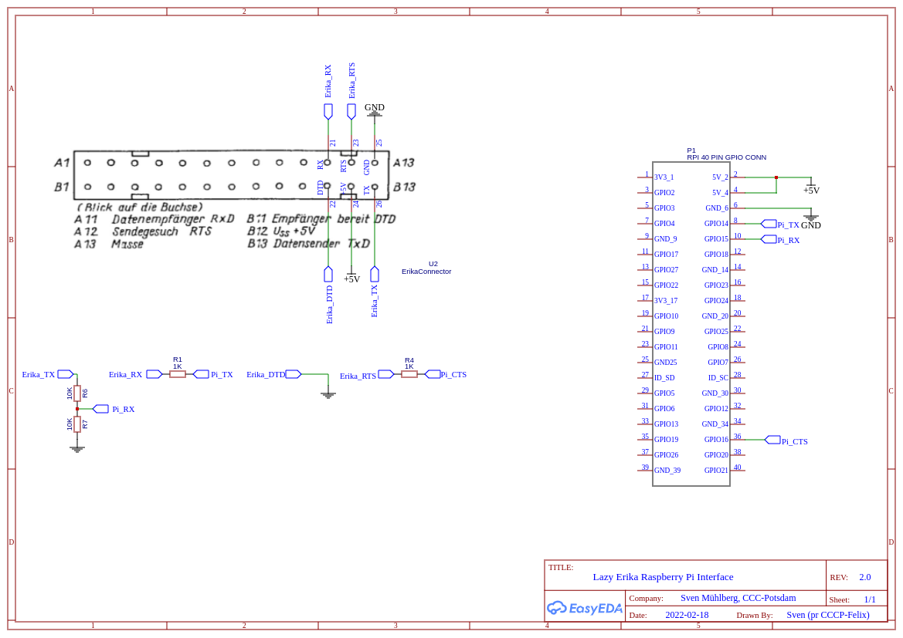

## Install erika service

### Prerequisites

You will need a installed linux system with working /dev/uinput and serial
connection with hardware rts/cts flow control.
If you like to use the service definitions, you also need systemd, else 
you need to integrate it in your system by yourself.

#### example raspberry Erika on GPIO header


*5v should only be connected if you like to power the raspberry from you Erika. And this should only be done with a low power raspi like Zero, Zero W maybe with Zero W 2.* 

1. install raspberry
2. take care, that serial port is enabled, but login shell on serial is off. keymap should be de for 105keys keyboard, since currently only german keymap is available. 
(all done via raspi-config)
3. copy the uart-cts to overlays  
`sudo cp raspberry/boot/overlays/uart-cts.dtbo /boot/overlays/`  
4. add following lines to config.txt (first one should already be there)
```
enable_uart=1
dtoverlay=miniuart-bt
dtoverlay=uart-cts
```
This makes sure that uart is enabled, the right uart is assigned to gpio port (and bluetooth get the simpler one and will also work).
It activates CTS on GPIO16 (pin 36 on gpio header)

#### known problems with ch34x serial-usb adapter

In case you like to use a ch340 USB-Serial adapter, then this info is for you.

The ch34x has a CTS pin but even when CTS pin is avaiable on your adapter hardware flow controll probably won't work, since default linux kernel driver ignores CTS and sends data even when it should stop.

A working driver for current linux kernel can be found here:

[https://github.com/juliagoda/CH341SER](https://github.com/juliagoda/CH341SER)

### manual installation from https://git.muehlberg.net

1. Verzeichnis erstellen
```sh
cd
mkdir -pv Development/SvenMb
cd Development/SvenMb
```
1. extract certificate for git.muehlberg.net:  
```sh
echo -n \\ | openssl s_client -showcerts -connect git.muehlberg.net:443 \
2>/dev/null  | sed -ne '/-BEGIN CERTIFICATE-/,/-END CERTIFICATE-/p' \
> mbnet_cert.pem
```
2. add the cert to your git config  
`git config --global http."https://git.muehlberg.net:443/".sslCAInfo $(pwd)/mbnet_cert.pem`
3. clone project directory  
`git clone https://git.muehlberg.net/SvenMb/erika.git`
4. change to project directory  
`cd erika`
5.  install python-evdev  
`sudo apt install python3-evdev` (z.Z. nur v1.4) oder 
`sudo pip3 install evdev` (aktuell v1.6)
6.  copy src to /var/lib/erika  
`sudo cp -R src /var/lib/erika`
7.  link /var/lib/erika/erika_set.py to /usr/bin/
`sudo ln -s /var/lib/erika/erika_set.py /usr/bin/`
8. copy systemd/system/erika.service to /etc/systemd/system/erika.service  
`sudo cp systemd/system/erika.service /etc/systemd/system/erika.service`
9. copy systemd/default/erika.service to /etc/default/erika  
`sudo cp systemd/default/erika /etc/default/erika`
10. change to cups directory
`cd cups`
11. start cups install script
`./create_ppd.sh`

### adapt to local system

* you can set different serial ports and other options in /etc/default/erika
* you can adjust the virtual printer port permission and name in /var/lib/erika/setperm.sh

### test service

* start erika service  
  `sudo systemctl start erika`
* get status of erika service  
  `sudo systemctl status erika`
* stop erika service  
 `sudo systemctl stop erika`

### enable service for autostart 

* enable service for default start  
  `sudo systemctl enable erika`
